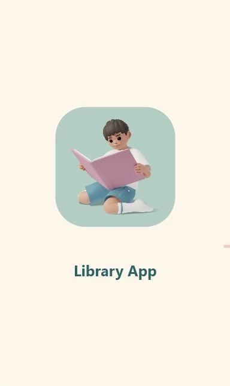
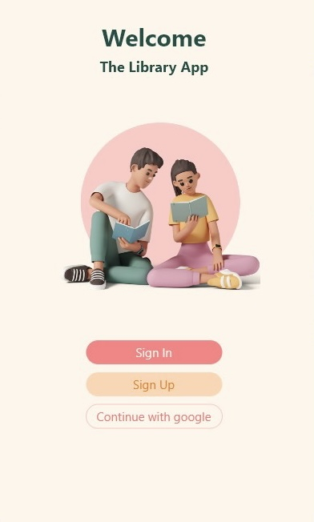
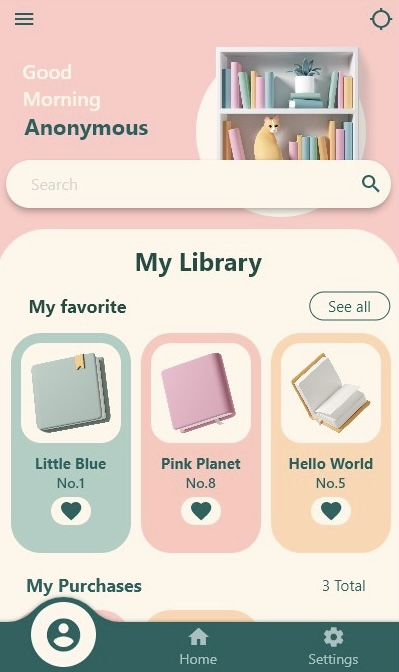
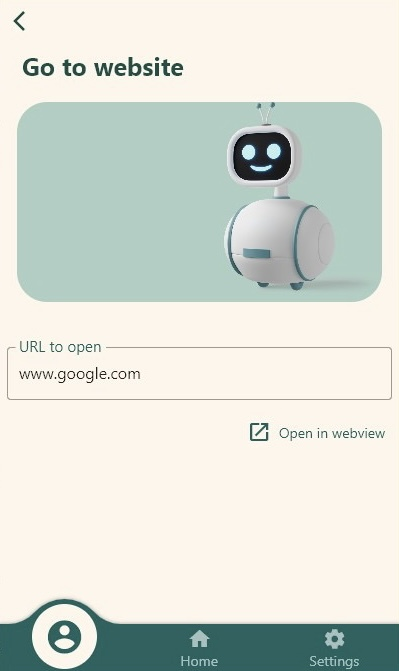
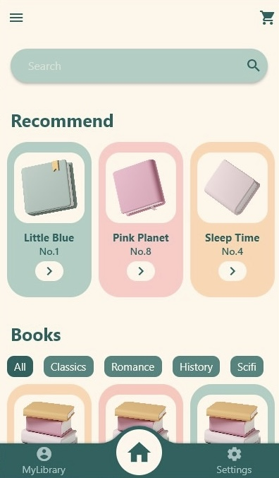
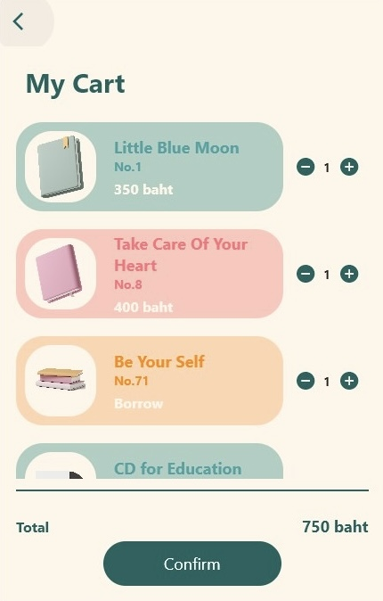
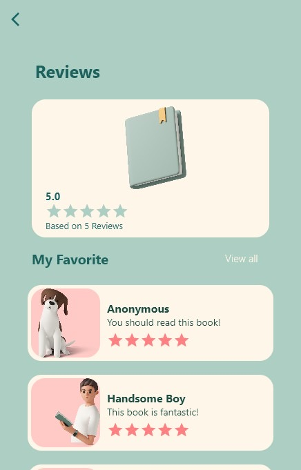
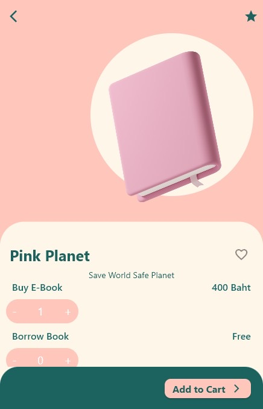
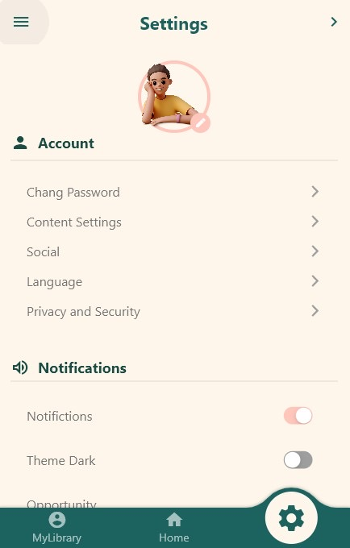
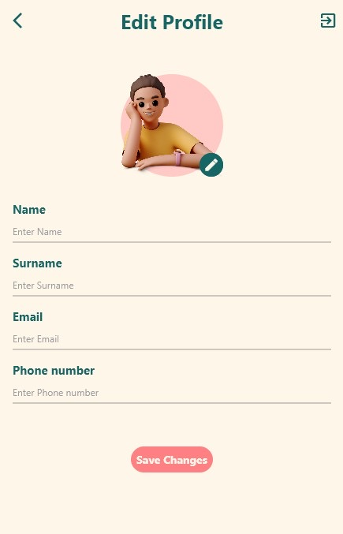

# Library Application Project

***+Non-responsive app+***

Library Application built with Flutter.

I've learned quite a bit about Dart and Flutter.

This project is a starting point for a Flutter application project.

## Screen Shots

 
Login

My Library

Browse

Home

My Cart

Book Reviews

Book Info

Settings

Edit Profile

